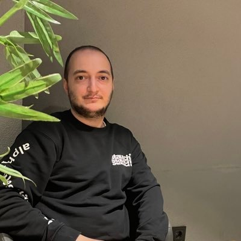

    <h1 align="center">Ahmet Hüdai Kaya</h1>
    <h3 align="center"> Android developer</h2>
    

I have been working as an Android Developer at Hugin company for the past one years. During this time, I
have developed POS device applications with Kotlin and Java development languages. Additionally, I have
some software projects on my GitHub that showcase my work. I have experience with MVVM architecture,
dependency injection, view binding, data binding, retrofit, and roomdb technologies.

<h2 align="center"> Work History </h2>

| <h2>Android Developer</h2>     |                  |
| ---                   | ---              |
| Hugin Payment Systems |                  
| 03/2022 - Present     | İstanbul, Turkey |
| Achivements/Tasks     |                  
| I used MVVM architecture, RxKotlin/Java, hilt, data binding, retrofit and room technologies at developments, |
| Developed secure applications for POS devices, |                    
| Git version control and code collaborator, |
| Agile system using trello task management system, |
| I made development via scrum system with a team of 5 people. |

| <h2>System Administrator</h2>     |                  |
| ---                   | ---              |
| <h3>Hugin Payment Systems</h3> |                  
| 04/2021 - 03-2022     | İstanbul, Turkey |
| Achivements/Tasks     |                  
| Managing CI-CD tasks via jenkins and gitlab, |
| Preparing to audits and managing audit process, |                    
| Managing, monitoring, creating and maintenance of docker, java, application services, proxmox, mysql, apache, nginx servers, |
| Analyzing problems and solving them, |

<h2>Skills</h2>

Kotlin, Java, Android, MVVM, Data Binding,
 
Dependency Injection with Hilt, Firebase, 
 
Retrofit, RoomDB, View Binding, Mysql, 
 
Sqlite, Couchbase

 
<h2>Languages</h2>

| English                       | Turkish      |
| ---                           | ---          |
| Full Professional Proficiency | Native or Bilingual Proficiency        |       

<h2>Interests</h2>
Swimming, Reading book, Preparing food, Researching technology trends
